# Doctor's Appointment & Prescription System (MERN Stack)

It is a System, by which Patients can consult with a doctor through online without any hassle. Patients can search for a Doctor and apply for his/her appointment. This application further shows the history of a particular patient so that the Doctor can prescribe on the basis of the history of the patient. The main objective of this application is to connect doctors and patients quickly and easily from any location over the internet. Patients can easily use this application by registering themselves, and the doctor can prescribe medicines to the patient based on their medical condition.

## Tech Stack

**Client:** ReactJS

**Server:** NodeJS, ExpressJS

**Database:** MongoDB

## Installation

Install my-project with npm

```bash
  git clone https://github.com/abu-noman30/Doctor-Appointment-and-Prescription-System-MERN.git
  npm install
```
    
## Project Demo:

### 1. Home Page:
##

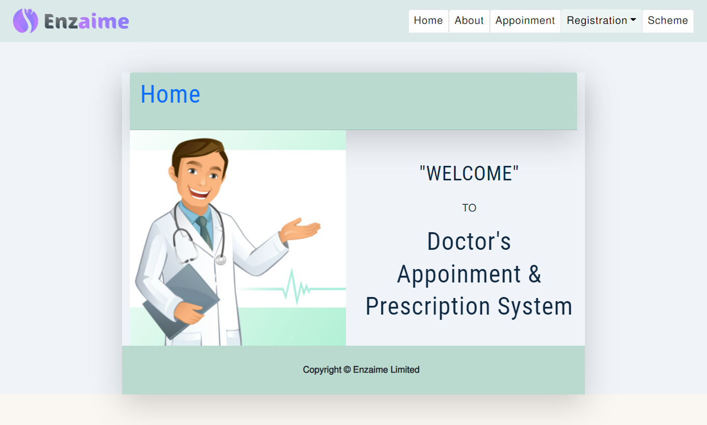

##
### 2. Patient & Doctor sign up:
##

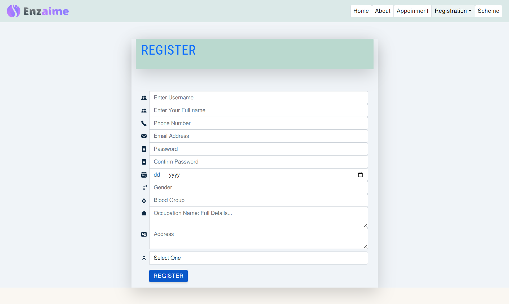

### 3. User Login:
##

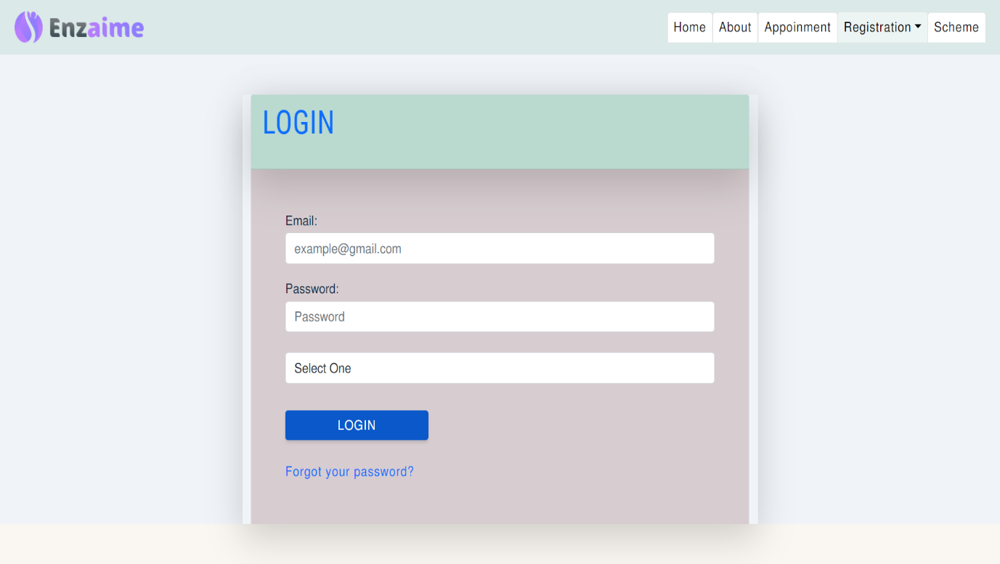

##
### 4. User Profile:
##

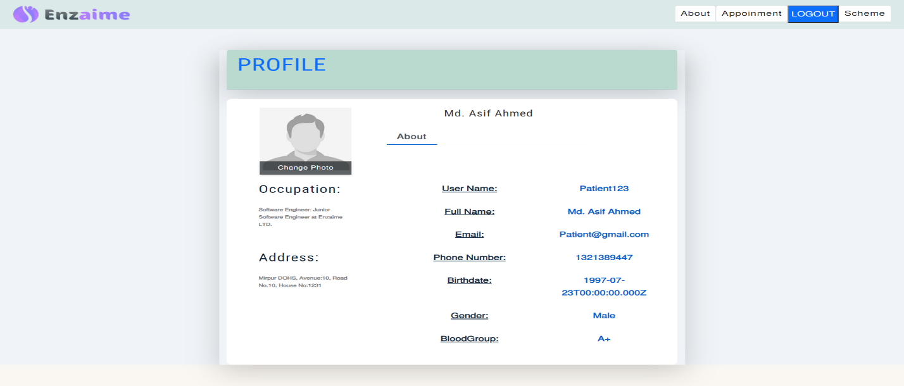

### 5. Appointment:
##

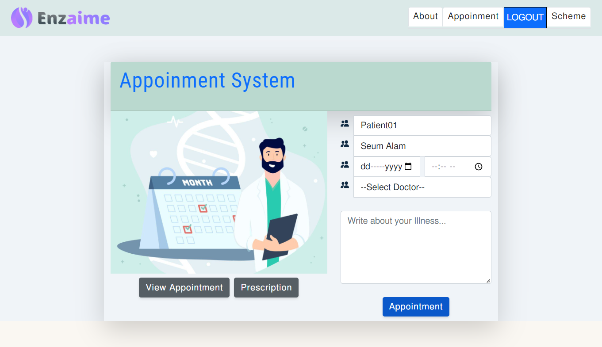

##
### 6. Doctor's Time Schedule:
##

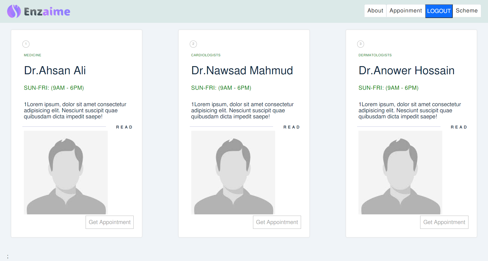

### 7. Admin Dashboard (Doctor):
##

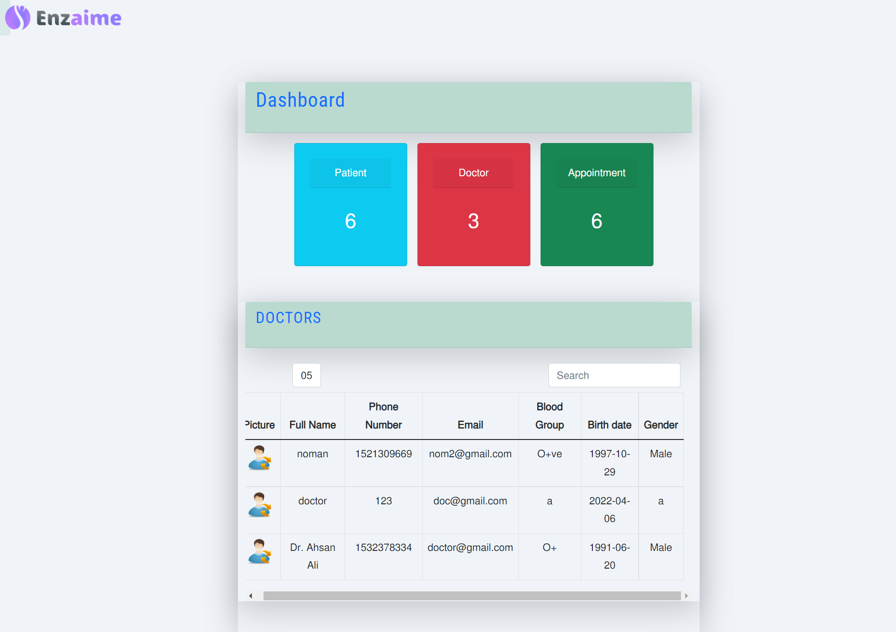

##
### 8. Appointments List:
##

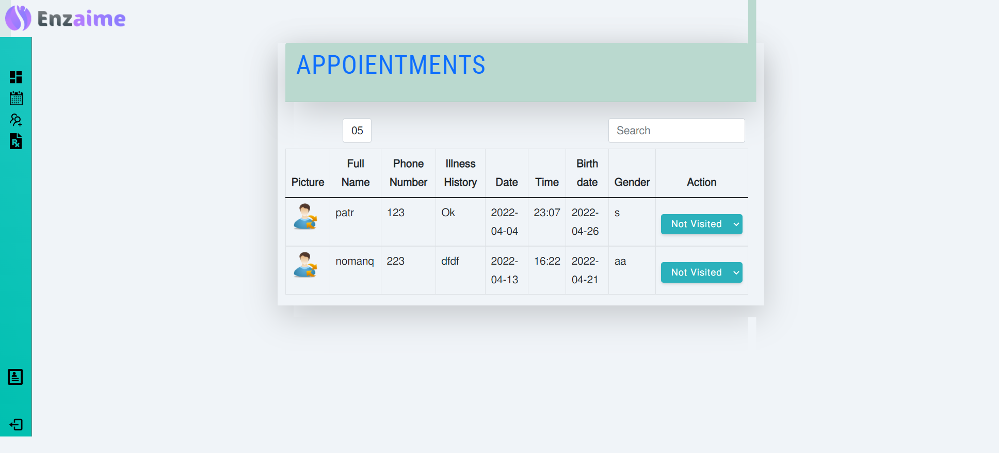

### 9. Patients List:
##

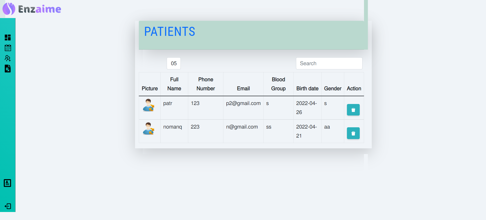

##
### 10. Create Prescription:
##

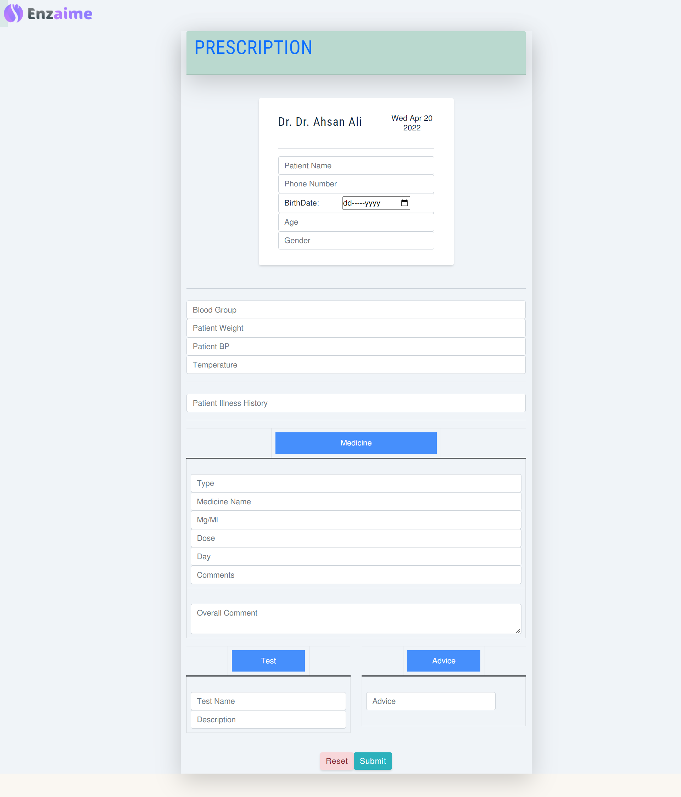

### 11. Prescription(PDF):
##

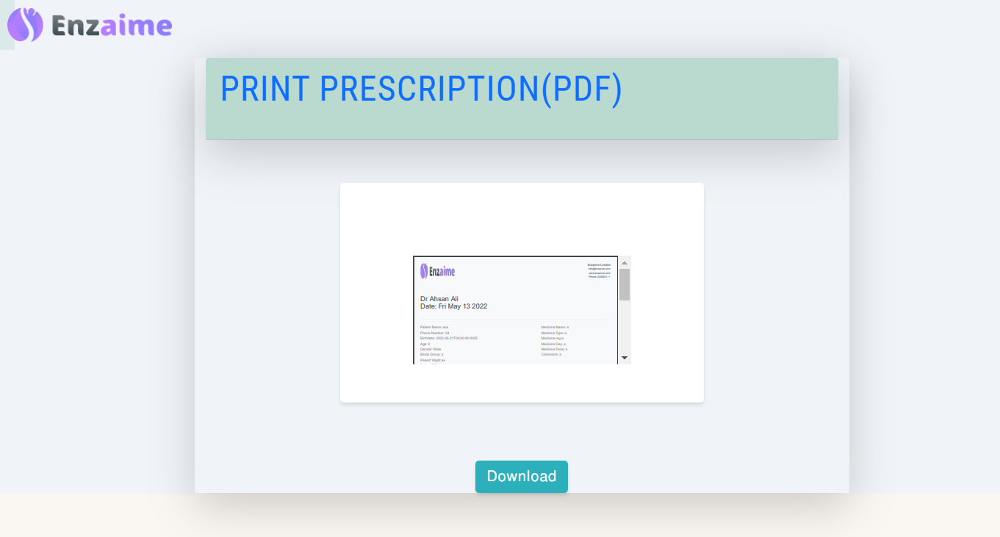


